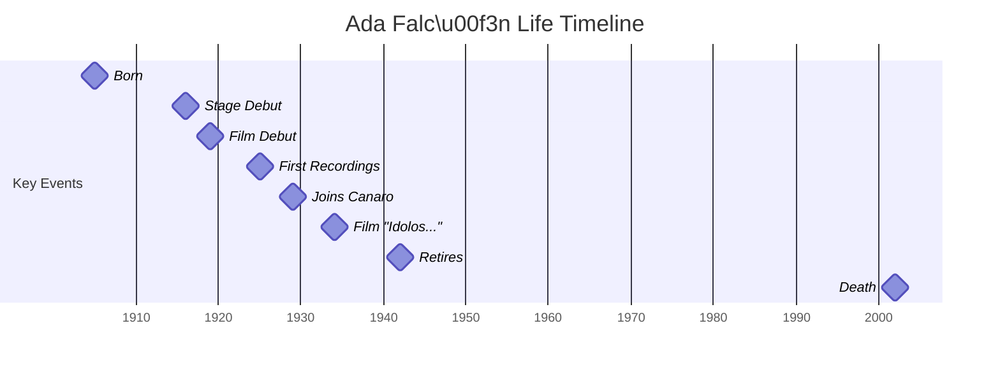

# Executive Summary

Ada Falcón (born *Aída Elsa Ada Falcone*, 1905–2002) was a celebrated Argentine tango singer, dancer and actress.  By the 1930s she was among the genre’s leading female vocalists, recording some 180–200 tracks and co-starring in tango films.  Her repertoire included standards like **“Tres esperanzas,” “Envidia,” “Destellos,”** and especially the Canaro-composed waltz **“Yo no sé qué me han hecho tus ojos,”** inspired by her famously green eyes.  Falcón’s decade-long collaboration and romantic liaison with orchestra leader Francisco Canaro (married at the time) produced many hits.  In 1942, at age 37, she abruptly left her career at its peak, withdrawing first to Buenos Aires and then with her mother to a convent in Córdoba, embracing a deeply religious, recluse lifestyle.  She rarely spoke to the press about her decision.  Ada Falcón lived quietly until her death in 2002 at age 96 in Molinari, Córdoba Province. 

# Early Life and Family

Ada Falcón was born *Aída Elsa Ada Falcone* on August 17, 1905 in the estancia “Los Paraísos” in Ituzaingó (Buenos Aires Province).  Her mother was Cornelia Boesio; the identity of her biological father was disputed (one story says wealthy landowner Miguel Anchorena).  She had two older sisters who also became singers (Amanda and Adhelma Falcone).  From age 4 Ada showed a talent for singing, and under her mother’s management she began performing as *“la joyita argentina”* (the Little Argentine Jewel).  At age 11 (circa 1916) she sang **tonadillas** at the famous Teatro Apolo in Buenos Aires.  As a result of her early career, she received most education at home.  In 1919 (age 13–14) she debuted on film in the silent movie *El festín de los caranchos*.

# Musical Career and Rise to Fame

Ada Falcón’s singing career took off in the mid-1920s.  On **15 July 1925** she made her first tango recordings: Victor label studio sessions with the Osvaldo Fresedo orchestra, including songs like *“Oro y seda”* and *“Pobre chica.”* These appear to be among the first Argentine tango records by a female soloist.  Between 1925 and 1927 she alternated theatre and variety shows in Buenos Aires.  By 1929 she had moved to Odeón Records: in early 1929 she recorded 14 tangos with pianist Enrique Delfino and guitarist Manuel Parada.  

On **24 July 1929**, Falcón joined Francisco Canaro’s famous dance orchestra, beginning with the recording of the tango *“La morocha.”*  From that point through 1938 she was the orchestra’s featured female vocalist.  She and Canaro recorded on the order of 180 tracks together, making her one of Argentina’s top tango recording stars.  Falcón brought a distinctive *mezzo-soprano* timbre to tango, standing out from the higher-voiced singers of the era.  She also performed as a duet partner with other stars: Ignacio Corsini, for example, sang with her on *“Corazón encadenado”* (1942).

By the early 1930s, Ada Falcón was a national celebrity.  She appeared frequently on the radio in Buenos Aires (Cultura, Stentor, Splendid, Argentina, Belgrano, and *El Mundo* stations) and filled major theaters.  In 1934 she starred in the sound film *Ídolos de la radio* (directed by Eduardo Morera) alongside Corsini, Olinda Bozán, Tita Merello and others.  In film clips and recordings of *“Yo no sé qué me han hecho tus ojos”* (a Canaro waltz written for her), her performance epitomizes her dramatic style.  By mid-decade she was often billed as *“La emperatriz del tango”* and won admiration for her beauty and stage presence.

> **Artistic Milestones:**  
> - *1925:* Debut tango record with Osvaldo Fresedo (Victor).  
> - *1929:* Joins Francisco Canaro’s orchestra; records “La morocha” and dozens more.  
> - *1934:* Film debut in *Ídolos de la radio*.  
> - *1935:* At her career’s apex, ceases public concerts and dedicates herself to radio performances.  

# Personal Life and Relationships

During her career, Falcón indulged in the high life of a star.  She bought furs and jewelry, owned luxury cars and a three-story house in the Palermo Chico district.  Ada’s most famous romance was with Francisco Canaro, a relationship that lasted about ten years.  The unwed couple was openly affectionate though Canaro remained married; he even dedicated the famous waltz *“Yo no sé qué me han hecho tus ojos”* (1933) to her eye color.  According to contemporaries, Falcón pressed Canaro to divorce his wife; Canaro negotiated with his lawyer but ultimately refused, fearing the financial cost.  According to one account, Canaro’s wife once burst into a rehearsal brandishing a pistol when she found Falcón in Canaro’s arms, after which Falcón and Canaro’s professional partnership ended in 1938.  

Ada Falcón never married.  Around 1929–1930 she is said to have had a brief affair with Mendoza politician Carlos Washington Lencinas (though this is a more obscure episode).  She remained famously reclusive offstage: by 1935 Falcón refused to sing in large public auditoriums and instead performed in the small *“Sala Falcón”* at Radio El Mundo.  She would drive her red convertible around to dry her hair after a bath, and reportedly insisted on singing behind a curtain in radio studios to hide her shyness.  

Rumors and legend surrounded her departure.  Tabloid stories claimed exotic eccentricities – two-hour baths, orange-paneled mansion walls, stage fright – that biographers consider at least partially apocryphal.  It is true that towards the end of the 1930s her live appearances became rare and mysterious.  On 28 September 1938, Falcón formally ended her engagement with Canaro’s orchestra.  In 1939 she reportedly performed on radio behind a curtain and even hid from her own musicians.  **Myth:** Some later legends say Falcón became a nun, refused to leave the house, or that sisters sang in her stead.  In fact, she never fully took monastic vows, though she did devote herself to Catholic prayer (especially at the Pompeya church).

# Retirement and Religious Life

In 1942, Ada Falcón’s withdrawal from secular life was sudden and permanent.  After recording her final songs (“Corazón encadenado” and “Viviré con tu recuerdo”) with Canaro’s orchestra, she sold her Palermo home and luxury cars, shared out her wealth to friends and family, and moved with her widowed mother to Salsipuedes in the hills of Córdoba Province.  By early 1943 press reports noted that the 37-year-old former diva had entered a Franciscan tertiary order and was living in a small convent cell in Córdoba.  In interviews late in life Falcón explained that she had “seen a marvelous vision of the Lord” and therefore “left everything to recluse in the hills with [her] mother”.  

For the next six decades, Ada Falcón lived quietly in Córdoba.  Her mother died in 1981; after this Falcón moved into a small Franciscan sisters’ retirement home near Cosquín.  In 1989 she briefly returned to Buenos Aires to address record-company matters (accusing her old label of not reissuing her songs, though in fact she had refused).  By then, she claimed that an impostor (allegedly her sister Adhelma) had been collecting her royalties for thirty years, but provided no proof.  Aside from these rare appearances, she avoided attention.  In later interviews she dismissed romanticizing questions (when asked if Canaro had been her great love, she replied "I do not remember").  Some friends noted late in life that she could read despite the sisters’ claims she could not.  Her decades of solitude sparked many cultural myths; modern historians sift fact from fiction by comparing archival interviews, church records, and testimonies.

# Death

Ada Falcón died of natural causes (heart failure, in the context of advanced age and arteriosclerosis) on January 4, 2002 in a sisters’ nursing home in Molinari, Córdoba.  She was 96.  Her remains were later transferred to Buenos Aires and interred in the SADAIC (authors’ society) mausoleum at Chacarita Cemetery, near Francisco Canaro’s plot.  Newspapers eulogized her as *“the Empress of Tango”* and recalled that in 1942 she had renounced the stage to seek God.

# Posthumous Works and Portrayals

Despite her self-imposed silence, Ada Falcón’s life attracted considerable cultural attention after her death.  In 2003 filmmakers Lorena Muñoz and Sergio Wolf released the documentary *Yo no sé qué me han hecho tus ojos* (I Don’t Know What Your Eyes Have Done to Me), retracing Falcón’s career and disappearance.  The film, narrated in a noir style, won awards and renewed interest in her story.  Falcón’s romantic saga with Canaro was dramatized in a 2010 Telefé TV special *“Te quiero”* on *Lo que el tiempo nos dejó*, in which actresses Julieta Díaz and Hilda Bernard played the young and old Falcón.  In 2013 her former Córdoba house in Salsipuedes was turned into the *Museo La Joyita* (named for her childhood nickname), preserving furniture and mementos of her career.  A second documentary (*Viviré con tu recuerdo*, 2016) by Wolf revisited her archive and won the BAFICI film festival prize.  

Ada Falcón **wrote no books** of her own and rarely gave interviews, so no autobiography exists.  Biographical works about her include numerous articles, the Todotango and clarinet-press biographies, and (most recently) *El alma del tango: Ada Falcón, la diva* (2025) by Elisa Vázquez de Gey and Eduardo A. Zavala, which blends documentary research with narrative.  A wealth of primary sources survives in Argentine archives: old newspaper profiles, radio transcription discs, recording company catalogs, and films.  Historians distinguish the *documented record* (dates of recordings, contracts, testimonials) from *rumor and legend* (e.g. fanciful tales of her eccentricities).  For example, many newspaper and eyewitness accounts confirm her performances behind a studio curtain and her daily church visits, whereas stories of miraculous apparitions or secret nun vows belong in the realm of folklore.  In all accounts, Falcón remains an enigmatic figure: a glamorous star who at midlife chose anonymity, making her one of tango’s enduring mysteries.

## Timeline

| Date/Year          | Event                                                                                      | Sources                   |
|--------------------|--------------------------------------------------------------------------------------------|---------------------------|
| **1905 Aug 17**    | Born *Aída Elsa Ada Falcone* at *Los Paraísos* estancia in Ituzaingó (Buenos Aires Prov.).      | [6], [31]                 |
| **1916**           | Age 11: Stage debut singing tonadillas at Teatro Apolo (Buenos Aires).     | [29]                      |
| **1919**           | Film debut in silent movie *El festín de los caranchos* (1919).      | [29]                      |
| **1925 Jul 15**    | First tango record (Victor) with Osvaldo Fresedo’s orchestra (tracks “Oro y seda”, *Pobre chica*). | [29]                      |
| **1929 (Jan)**     | Records 14 tracks for Odeón with Enrique Delfino and Manuel Parada.          | [31]                      |
| **1929 Jul 24**    | Joins Francisco Canaro’s orchestra; records “La morocha” and ~180 songs together. | [21], [31]                |
| **1934**           | Film role in *Ídolos de la radio* (directed by Eduardo Morera, co-starring Ignacio Corsini, Tita Merello, etc.). | [29]                      |
| **1935**           | At height of fame, stops stage concerts (only performs in small “Sala Falcón” on radio).  | [31]                      |
| **1938 Sep 28**    | Ends professional partnership with Canaro.                                     | [31]                      |
| **1939**           | Performs in radio studios behind a curtain to avoid being seen.            | [31]                      |
| **1942**           | Final recordings (*Corazón encadenado*, *Viviré con tu recuerdo*); abruptly retires from music; sells assets and moves to Córdoba with mother.  | [31], [21]                |
| **1942–2002**      | Lives as a Franciscan tertiary in Córdoba Province; mother dies (1981); conducts no public performances.  | [21], [7]                 |
| **2002 Jan 4**     | Dies of natural causes in a Camillian Sisters home in Molinari, Córdoba, age 96.  | [27]                      |
| **2003**           | *Documental* *Yo no sé qué me han hecho tus ojos* premieres (dir. Wolf/Muñoz). | [49]                      |
| **2010**           | TV drama *Lo que el tiempo nos dejó* airs episode “Te quiero” about Falcón; Julieta Díaz/Hilda Bernard portray her. | [49]                      |
| **2013**           | House at Salsipuedes converted into *Museo La Joyita*, preserving her memorabilia. | [49]                      |
| **2016**           | New documentary *Viviré con tu recuerdo* (dir. Wolf) released.           | [49]                      |

# Bibliography

- Ada Falcón biography (Néstor Pinsón) – *TodoTango.com*: English-language biographical essay.  
- **La Nación**, *“Murió ayer Ada Falcón”* (Jan 5, 2002 obituary by Renée Vargas Vera).  
- Fernanda Jara, “De la fama a la auto-reclusión: la vida triste de Ada Falcón…” – *Infobae* (Jan 4, 2019).  
- **FACETS Film Forum**, *“The Unbelievable Story of Ada Falcon”* (article, Sep 25, 2019).  
- Ada Falcón – *Wikipedia (es)*: Spanish encyclopedia entry (contains bibliography and links).  

**Sources:** Primary sources include Argentine newspapers (*La Nación*, *Clarín*), film archives (*Ídolos de la radio*), and radio/record catalogs. Scholarly and archival materials are scarce; most biographical detail comes from journalistic accounts, interviews and documentary filmmakers’ research. Secondary sources include *TodoTango* and *Infobae*, which compile archival facts. Myths and later portrayals are drawn from documentary commentary.

## Atlas Connections

### Carlos Gardel

- **[T4] Documented fact:** Falcón and Gardel appeared on the same bill at a benefit honoring the crew of the hydroplane *Buenos Aires* at Teatro Smart, Buenos Aires, on July 24, 1926. They again performed at the same event on October 24, 1927, during a farewell tribute to tenor Mario Cappello at Teatro Marconi. The evidence establishes shared venues and programs, but not a duet. ([Investigación Tango](https://www.investigaciontango.com/inicio/index.php?Itemid=56&catid=36%3Acancionistas&id=73%3Amujeres&option=com_content&view=article); [Fundación Internacional Carlos Gardel](https://fundacioncarlosgardel.org/biografia/1927-discos-actuaciones-y-homenajes))
- **[T5] Reported fact:** A retrospective in *La Prensa* described Falcón as Gardel’s friend and artistic colleague. This supports a personal connection, although the surviving source supplies no particulars about private meetings. ([*La Prensa*, January 6, 2012](https://www.laprensa.com.ar/-v2-nGVYAAZrb4S1tdmqK0uFHZuqmwHKX%28%2847%3B%29%296qyX3uPVdUbZ0%3D-archive.aspx))

### Enrique Santos Discépolo

- **[T5] Reported fact:** *La Prensa* identified Falcón and Discépolo as friends and artistic colleagues. Falcón also recalled Discépolo speaking admiringly about her, providing retrospective evidence that they knew one another personally, though no dated encounter has been located. ([*La Prensa*, January 6, 2012](https://www.laprensa.com.ar/-v2-nGVYAAZrb4S1tdmqK0uFHZuqmwHKX%28%2847%3B%29%296qyX3uPVdUbZ0%3D-archive.aspx); [Ada Falcón biography](https://es.wikipedia.org/wiki/Ada_Falc%C3%B3n))
- **[T9-] Documented fact:** Discépolo’s compositions passed into Falcón’s recorded repertoire. Documented examples include her Odeón recording of “Soy un arlequín” on June 4, 1929 and her interpretation of “Tres esperanzas” with Francisco Canaro’s orchestra on June 16, 1933; her rendition of Discépolo’s “Secreto” is likewise preserved and discussed as a distinctive interpretation. Falcón is the later performer in this shared-work connection. ([Falcón discography](https://milongandoblog.wordpress.com/2017/07/10/ada-falcon-discografia/); [Bazar Americano](https://www.archivobazar.com/columnas.php?cod=176&pdf=si))

### Ángel Villoldo

- **[T9-] Documented fact:** Falcón’s first recording with Francisco Canaro’s orchestra was “La morocha” on July 24, 1929. The work originated in 1905 with music by Enrique Saborido and lyrics by roster member Ángel Villoldo, who died in 1919; Falcón therefore occupies the later-performer side of this shared musical work. ([Todo Tango: Ada Falcón](https://www.todotango.com/creadores/biografia/148/Ada-Falcon/); [Biblioteca Nacional de la República Argentina](https://www.bn.gov.ar/micrositios/admin_assets/issues/files/c81010a62753c6836ef11d14876ac1ff.pdf))

No other roster crossing was found that met the stated evidentiary and typological requirements; mere contemporaneity, common geography, shared tango culture, religious tradition, or later joint commemoration was excluded.

### Connection Tags

Machine-readable summary of this dossier's Atlas Connections, added 2026-09-05 during the connections-harmonization pass. Types: T1 wrote about a past figure, T2 prophecy/hyperstition, T3 discourse, T4 proximity/milieu, T5 friendship/meeting, T9 shared object or site. Sign + = this subject is the earlier/source figure, - = the later figure, blank = undirected. See the prose above (or the counterpart's own dossier) for the full claim.

- **Carlos Gardel** [T5]
- **Enrique Santos Discépolo** [T5]
- **Ángel Gregorio Villoldo** [T9-]
- **Enrique Santos Discépolo** [T9-] (mirrored from enrique_santos_discepolo.dossier.md)
- **Max Glücksmann** [T4] (mirrored from max_glucksmann.dossier.md)

