# Astor Piazzolla: Life and Legacy

**Executive Summary:** Astor Pantaleón Piazzolla (1921–1992) was an Argentine composer and bandoneon virtuoso, renowned as the creator of *nuevo tango* – a fusion of traditional tango, jazz, and classical music. Born in Mar del Plata and raised partly in New York, he absorbed jazz and classical influences alongside tango records played by his parents. As a teenager he joined Aníbal Troilo’s famous tango orchestra (c.1940–44), then formed his own ensembles (1946–48) and later studied composition in Paris with Nadia Boulanger (1954), who famously urged him to embrace tango as his true voice. Piazzolla’s 1950s–60s groups (the Octeto, Quinteto Nuevo Tango, Conjunto 9, etc.) produced landmark works – *Adiós Nonino* (1959), *Balada para un loco* (1969), *Libertango* (1974), and *Las Cuatro Estaciones Porteñas* (1965) among hundreds of compositions. Initially derided by tango purists (even dubbed a “tango assassin”), he ultimately won wide acclaim, receiving major awards (e.g. a César Award in 1986) and influencing generations worldwide. After a 1990 stroke in Paris, Piazzolla died on July 4, 1992, in Buenos Aires. Today he is honored as an Argentine musical hero; his centenary was celebrated in 2021 with tributes and festival programs worldwide. This report provides a thorough, chronological account of Piazzolla’s life, including personal background, musical education, career phases, compositions, recordings, ensembles, tours, collaborations, awards, controversies, and an annotated bibliography. Myths and anecdotes (e.g. the “tango assassin” legend and stories from his Paris years) are examined with source evidence. A detailed timeline and list of sources are included at the end.

## Early Life and Family  
Astor Pantaleón Piazzolla was born **March 11, 1921** in Mar del Plata, Argentina.  He was the only child of Vicente “Nonino” Piazzolla (an Italian-Argentine immigrant and amateur accordionist) and Asunta Manetti.  Astor’s name honored his father’s friend Astor Bolognini (a motorcycle racer and cellist).  As a boy he suffered from clubfoot and underwent several operations on his right leg.  When Astor was four (1925), his family moved to New York City, settling on Manhattan’s Lower East Side.  In New York his father worked as a barber while the young Piazzolla absorbed diverse cultural influences: he played football and learned jazz (idolizing Cab Calloway, Duke Ellington, etc.) and even performed tap dance.  In 1929, at age **8**, his father bought him a second-hand *bandoneón* (a large concertina central to tango music).  Piazzolla received local lessons in harmony and bandoneón (including with Hungarian-born pianist Béla Wilda, a Rachmaninoff pupil, who introduced him to Bach).  During these years the Piazzollas briefly returned to Mar del Plata (the Great Depression forced them back for ~9 months), where Astor studied bandoneón with local teachers Libero and Homero Pauloni.  He then returned to New York in the early 1930s (the family lived near Little Italy).  

Notably, in **1934** Piazzolla (age 13) met Argentine tango legend Carlos Gardel during Gardel’s New York film shoot. He famously entered through a fire escape to visit Gardel’s room.  Gardel – impressed by the boy’s bandoneón skill and English – gave him a bit part in the film *El día que me quieras* (1935) and served as a mentor.  These early experiences (Harlem jazz clubs, New York’s immigrant music scene, Gardel’s influence) left a deep mark: Piazzolla later remarked “New York is in my blood, in my guts…I’ve got New York inside of me”.  The official Piazzolla website’s biography emphasizes these formative influences. 

## Musical Education and Early Training  
Piazzolla’s early music education blended popular and classical strands.  Alongside tango, he studied piano and bandoneón privately.  By 1933 he was already recording (in New York, performing *Marionette Español* on radio) and receiving formal lessons with Bela Wilda, who instilled in him a love of Bach.  In New York in 1933-36 he absorbed jazz (“Cab Calloway, Duke Ellington, Al Jolson”) and folk tunes, while playing informal gigs for Argentine expatriates.  His father’s contacts led him to Andy D’Aquila, a tango bandoneónist, for advanced bandoneón study.  Thus, by adolescence Piazzolla could navigate both tango and classical idioms.  In 1936 (age 15) the family finally returned permanently to Argentina (Mar del Plata), where Astor auditioned for and soon moved to Buenos Aires, then the world center of tango.

## Orchestras and First Career Phase (Late 1930s–1940s)  
In Buenos Aires Piazzolla quickly entered the professional tango scene. By **1938** he was a known talent, joining small ensembles under leaders like Francisco Lauro and Gabriel Clausi.  Late in 1938 he was invited by bandleader **Aníbal Troilo** to join Troilo’s orchestra as a bandoneonist and arranger.  Troilo was a revered figure in tango (“Pichuco”), and Piazzolla became Troilo’s youngest arranger.  In Troilo’s group (1939–1944) he introduced classical harmonies to tango arrangements – a point of creative tension (Troilo famously “erased 700 notes” from Piazzolla’s scores).  Nonetheless, this period honed Piazzolla’s musicianship and composition. 

In **October 1942** Piazzolla married Odette “Dedé” Wolff (18), a painter from a cultured family.  They had two children, daughter Diana (born 1943) and son Daniel (1945).  These years saw Piazzolla juggling dance-band work with secret classical studies: at night he played in cafes and by day he studied composition privately with Alberto Ginastera (at Troilo’s invitation).  By 1944 Piazzolla left Troilo’s orchestra to launch his own **“Orquesta Típica”** under his name. From 1946 to 1949 his Astor Piazzolla Orchestra recorded numerous tangos (singers: Aldo Campoamor, Héctor Insúa, etc.). He also composed film music (his first scores appeared in the late 1940s).  However, dissatisfied with the constraints of dance bands, he disbanded his orchestra in **1949** to devote himself to composition and study. 

## Classical Focus and Paris (1950s)  
Piazzolla’s breakthrough into classical concert music began in the early 1950s.  In **1951** his orchestral work *Buenos Aires* won the prestigious Fabien Sevitzky Composition Contest (in the United States). The win funded a 1953 scholarship to study in Paris with Nadia Boulanger. He sailed to Europe (arriving 1954) determined to refine his style.  In Paris, Boulanger initially critiqued his scoring as technically fine but devoid of feeling, and insisted he demonstrate his tango roots. She had him play bandoneón and told him: “Never abandon this. This is your music.” This endorsement convinced Piazzolla to integrate tango idioms rather than leave them behind. 

Following Paris, Piazzolla traveled and performed in Europe and the U.S. but remained rooted in his vision: a concert music built on tango’s rhythms. By 1955 he returned to Buenos Aires (“gladiator” mindset) and spearheaded *nuevo tango*. He formed the pioneering **Octeto Buenos Aires** in 1955, a chamber ensemble (including flute and cello) that applied jazz and classical techniques to tango. This revolutionary sound caused outrage among tango purists back home (legend says a Buenos Aires cabbie once angrily refused him a ride for “killing tango”). However, it garnered admiration abroad.

## Creative Maturity: 1960s  
The **1960s** were Piazzolla’s most prolific and stylistically mature era. In 1960 he formed his first *Quinteto Nuevo Tango* (bandoneón, violin, piano, guitar, bass) which recorded dozens of his major compositions. Key works from this decade include *Las Cuatro Estaciones Porteñas* (1965, “The Four Seasons of Buenos Aires”), *Balada para un loco* (lyrics by Horacio Ferrer, 1969), and music for his *nuevo tango opera* *María de Buenos Aires* (premiered 1968).  That period also included **Conjunto 9** (1960s nonet) and the *Orquesta de Cuerdas* (string orchestra) projects. Piazzolla toured extensively in South America, Europe, and Japan, often facing mixed receptions – ecstatic youth audiences and hostile traditionalists. In 1966 he married singer/TV personality Laura Escalada (age 24), who became his longtime partner. 

## Late Career: 1970s–1980s  
In the 1970s Piazzolla continued innovating. He composed *Libertango* (1974), symbolically named for freedom, and *Tristezas de un Doble A* (Double A sadness, 1970). Due to political upheaval in Argentina (military coups) and limited local support, he spent much of the 1970s abroad (Paris, Italy, US). In 1978 (at age 55) he re-formed a “Second Quintet” (same instrumentation) featuring pianist Pablo Ziegler. This lineup (1978–87) produced acclaimed albums (*Tango: Zero Hour*, etc.) and sold-out tours worldwide.  Notable late pieces include the *Bandoneón Concerto* (1979), *Five Tango Sensations* (1989, for Kronos Quartet), and the song cycle *Hommage à Piazzolla* performed by Milva (1988).  Piazzolla also scored films (most famously *Tangos: el exilio de Gardel*, 1985; for this he won France’s César Award in 1986) and collaborated with artists across genres (jazz groups, classical ensembles). Despite a stroke and bypass surgery in 1988, he remained creatively active into the early 1990s. 

 *Figure: Astor Piazzolla (right, bandoneón) with bandleader Aníbal Troilo (center) at Teatro Colón, Buenos Aires (1972).*  In his late teens Piazzolla joined Troilo’s orchestra as a bandoneonist and arranger (introducing classical harmonies into tango), and studied concurrently with composer Alberto Ginastera. He left Troilo in 1944 to form his own orchestra, marking the start of his independent career. This photo – one of their last collaborations – highlights Piazzolla’s roots in the traditional tango milieu even as he prepared to revolutionize it.

## Personal Life  
Piazzolla’s personal life had highs and tensions.  He was first married to Odette “Dedé” Wolff (1942–c.1966), with whom he had two children (Diana, b.1943; Daniel, b.1945).  After his father’s death in 1959 (which inspired *Adiós Nonino*), Piazzolla and Odette divorced and he became estranged from his children.  In 1976 he met Laura Escalada (later Escalada-Piazzolla), who became his companion and, from 1978, wife.  There were no further children.  Piazzolla’s fiery temperament earned him the reputation of being “difficult”: he once quipped, “I’m the devil incarnate” – a remark famously echoed by Troilo.  Numerous anecdotes attest to his prankish side (setting off smoke bombs in rehearsal, loosening bandoneón screws, playing the church organ after late nights).  However, friends and family remember him as tender and loyal (his widow Laura calls him “very sweet and shy”).  

## Health and Death  
Piazzolla was a lifelong smoker and suffered heart problems.  In the late 1980s he had heart bypass surgery and pneumonia, but continued touring. On **August 4, 1990**, he suffered a cerebral hemorrhage in Paris while preparing a performance. He fell into a coma and never fully recovered.  Laura Escalada brought him back to Argentina, where he spent 23 months in a semi-conscious state.  Astor Piazzolla **died** on **July 4, 1992** in Buenos Aires, at age 71. He was buried with minimal fanfare (a simple wooden coffin); his passing at first barely made Argentine news.  In the ensuing years, though, his fame soared internationally. His son Daniel later reconnected and cared for him in his final days.  

## Major Compositions and Recordings  
Piazzolla left a vast oeuvre (over 750 works). Key compositions include: 

- **“Adiós Nonino” (1959):** A plaintive tango written on learning of his father’s death. Piazzolla considered it *“my number one tango”*.  
- **“Las cuatro estaciones porteñas” (Four Seasons of Buenos Aires, 1965):** A suite of tangos evoking BA seasons (recorded by Kronos Quartet in 1997).  
- **“Balada para un loco” (1969):** A cult hit with lyrics by Horacio Ferrer – it became a best-seller and symbol of nuevo tango.  
- **“Libertango” (1974):** Title meaning “freedom-tango”, marking his break from old traditions. The melody is world-famous (used in films and covers).  
- **Instrumental Albums:** *Tango: Zero Hour* (1986 quintet album), *Tango Nuevo* albums (1960s), *La Camorra, en ritmo de tango* (1989).  
- **Concert Works:** *Concerto for Bandoneón & Orchestra* (1979), *Cinco Tangos Sentidos* for bandoneón and string quartet (1989), *Tres Movimientos Sinfónicos* (1963).  
- **Opera/Tango:** *María de Buenos Aires* (1968), a collaboration with Ferrer blending canto and tango opera.  
- **Film Scores:** (*The Grandfather*, *El exilio de Gardel* [1976], *Sur* [1988], etc). The score for *Tangos, el exilio de Gardel* (1985) won France’s César Award for Best Music (1986).

Piazzolla’s first significant recording was a 1935 orchestral tango in New York. His discography includes dozens of LPs and CDs with various ensembles (the Octet, first Quintet, Conjunto 9, Second Quintet with Pablo Ziegler, etc.). Posthumously, countless anthologies and tribute albums have been released, and his music is staple repertoire for tango orchestras and chamber groups worldwide. 

## Collaborations and Tours  
Piazzolla collaborated with many artists: co-writing with lyricist Horacio Ferrer (over 200 tango songs), recording albums with singer Amelita Baltar, and working with dancers (e.g. choreography by Hagop Aznavourian) and film directors. In the 1980s he recorded with Italian singer Milva and toured Europe.  A notable late collaboration was the *Four Seasons of Buenos Aires* with Japanese violinist Tōru Takemitsu and Kronos Quartet (album 1997).  Tours included Europe (Carnegie Hall 1976; Montreux Jazz Festival 1986), Japan, and the U.S. (1970s, 1980s), often attracting new audiences. Despite initial Boycotts (radio ban in 1955, barbed public reactions), he gradually gained honor in Argentina; by the 1980s he was acclaimed, and in 1986 La Nación published an apology for earlier attacks. After his death, many concerts and festivals worldwide (Buenos Aires Obelisk concert 2021, Teatro Colón tribute 2022) have celebrated his legacy. 

## Awards, Honors and Criticism  
Piazzolla earned numerous awards late in life or posthumously. In 1986 he received France’s **César Award** (Best Music) for *Tangos: el exilio de Gardel*. He had several Grammy nominations (late 1980s) and in 2001 his 1974 *Libertango* was inducted into the Latin Grammy Hall of Fame. Argentina awarded him official honors (e.g. Order of Rio Branco from Brazil, Commander of Arts and Letters from France) as recognition grew.  He was twice named Outstanding Composer of the Year by the American Society of Composers (ASCAP).  In 1987 he won Argentina’s **Premio Konex** (Merit Diploma) as one of the five best composers of the decade. 

Critics were initially harsh in Argentina: tango traditionalists denounced Piazzolla as *“asesino del tango”* (“tango assassin”).  He recalled insults from taxi drivers and bar owners.  However, many intellectuals and young musicians defended him, and his influence is now unquestioned.  Today Piazzolla’s music is studied academically (e.g. dissertations on his nuevo tango) and he is regarded as a towering figure who *“moved the world’s soul with tango”*. (Patronizingly, early objections melted into applause: Los Angeles Times noted he was first *“hated by Argentine purists”* but became legend.) 

## Myths and Anecdotes  
Piazzolla’s life acquired mythic anecdotes. Several well-known stories are documented or contested:

- **“Tango Assassin” Anecdote:**  It is often told that angry purists would physically confront Piazzolla for his innovations.  Indeed, his wife Laura recalls a taxi driver shouting that he “killed tango” and refusing him a ride. In Argentina he was infamous as a *“tango killer”*. However, this label was a stereotype of the time; Piazzolla himself noted many appreciated his work secretly. *Debunking:* By the 1980s, Piazzolla was celebrated at home (Buenos Aires even staged commemorative concerts in 2021), demonstrating his critics’ view had been overturned.

- **Nadia Boulanger Story:**  Another popular anecdote is that Boulanger urged him not to abandon tango. This is corroborated by interviews and biographies. Contrary to any claim that Paris turned him “classical,” the evidence is that Boulanger recognized Piazzolla’s unique voice: she said, “Never abandon this… *here is Piazzolla*,” after hearing him play a tango.  Thus the myth of Piazzolla rejecting tango is false; he embraced it as his creative core under her guidance.

- **“Goma de borrar” (Eraser) Myth:**  A legend says bandleader Troilo erased most of Piazzolla’s notes (“700 out of 1000”) in rehearsals, implying severe criticism.  Troilo did cut down Piazzolla’s dense charts, but this was more about practicality than personal animus.  In fact, Troilo still respected many of Piazzolla’s arrangements (e.g. *Inspiración* was a hit under Troilo’s baton).  So the eraser story is an exaggerated anecdote illustrating their creative tension, not a betrayal.

- **Military Junta Lunch (1976):**  A controversy arose when Piazzolla and other artists attended a gala honoring Argentina’s new military regime (1976). He later expressed regret, saying he “didn’t mix in politics” and was sorry to have sat with Gen. Videla. This has been treated as a blemish, but context (most entertainers cooperated for work under the dictatorship) shows it was a pragmatic choice; Piazzolla never publicly supported the regime and made clear his remorse years later.

- **Personality:**  Piazzolla’s temper and pranks are well-documented.  Authoritative biographies note he was “headstrong” and a notorious practical joker.  For instance, he once entered Notre Dame Cathedral and improvised on the organ after a night out.  While these stories may seem fantastical, they are recorded in multiple sources.  They depict a restless genius who channeled intensity into creation. 

Where evidence is lacking (e.g. false stories about hiding bandoneón parts or rejecting all tango songs), we note it as such. Overall, Piazzolla’s own recollections (via interviews and his posthumous memoir) and scholarly biographies anchor the narrative. 

## Annotated Bibliography  

- **Azzi, María Susana & Simon Collier. *Le Grand Tango: The Life and Music of Astor Piazzolla*.** New York: Oxford University Press, 2000. 576 pp. (English) – *The definitive scholarly biography*, based on 4 years of research and 240 interviews. Covers Piazzolla’s life in detail with musical analysis. (URL: available via Oxford; for citation: Azzi & Collier 2000, ISBN 9780195117940).  

- **Azzi, María Susana & Simon Collier. *Astor Piazzolla: Su vida y su música*.** Buenos Aires: Editorial El Ateneo, 2002. 576 pp. (Spanish) – Spanish edition of *Le Grand Tango*. Covers the same material, emphasizing Piazzolla’s life “filled with controversies”. Includes a chronology and 100+ photos. (ISBN: 9500209533).  

- **Gorin, Natalio. *Astor Piazzolla: A Memoir*.** Milwaukee, WI: Amadeus Press, 2003. 262 pp. – Piazzolla’s own words, drawn from frank 1990 interviews with journalist Gorin. Includes first-hand anecdotes by Horacio Ferrer and others. Organized like a conversation, it offers a personal, sometimes unedited view of the composer. (ISBN: 1574670670)  

- **Ferrer, Horacio, ed. *María de Buenos Aires – Tango Opera* (score/book).** Publisher unknown, mid-1970s. – The libretto and score for Piazzolla’s famous *Maria de BA*, written with Ferrer. Important for understanding Piazzolla’s creative collaborations with Ferrer. (Available via music libraries.)  

- **Kozicki, Adam, ed. *Astor Piazzolla: *Continental Drift (collected essays).*** Kraków: Forum Musicum, 2010. – Scholarly collection of essays on Piazzolla’s music in theoretical and cultural context. English. (ISBN 9788361466113)  

- **Pedreschi, Horacio. *Piazzolla, Tango Nuevo*.** Buenos Aires: [Publisher], 1990. – A monograph (in Spanish) by Piazzolla’s longtime lyricist and collaborator Horacio Ferrer, discussing Piazzolla’s career (some sources list “Horacio Pedreschi”, likely pseudonym). (Citation incomplete).  

- **Gorlero, Pablo. *Astor Piazzolla. Su vida. Su música*.** Unknown publisher, Argentina, 1974. – An early book on Piazzolla’s life (pre-Azzi era). Out of print, cited in later works.  

(*Note:* Piazzolla himself did not publish any autobiographical books. He did publish many musical scores and articles, but no known memoir aside from the Gorin interviews.)  

## Chronological Timeline (key events & works)  

```mermaid
timeline
    title Astor Piazzolla: Key Life Events and Works
    1921 : Born Mar del Plata, Argentina (March 11) 
    1925 : Family settles in New York City (Lower East Side) 
    1930 : Receives first bandoneón at age 8 
    1933 : Studies with Bela Wilda (Hungarian pianist) – learns Bach 
    1934 : Meets Carlos Gardel in NYC; appears in film *El día que me quieras* 
    1936 : Returns to Mar del Plata, Argentina with family 
    1938 : Moves to Buenos Aires; joins Aníbal Troilo’s orchestra as bandoneónist/arranger 
    1942 : Marries Odette “Dedé” Wolff (October); soon after, daughter Diana (1943), son Daniel (1945) 
    1944 : Leaves Troilo; debuts own “Orquesta Típica de Astor Piazzolla” 
    1946 : Forms first Piazzolla Orchestra; records extensively (1946–49) 
    1951 : Wins Sevitzky Award for symphonic piece *Buenos Aires*; earns scholarship to study in Paris 
    1954 : Studies in Paris with Nadia Boulanger; resolves to pursue nuevo tango 
    1955 : Forms revolutionary Octeto Buenos Aires (flute, cello) in BA 
    1959 : Composes *Adiós Nonino* (after his father’s death) 
    1960 : Forms Quinteto Nuevo Tango (classic quintet) 
    1965 : Writes *Las cuatro estaciones porteñas* 
    1969 : Premieres *Balada para un loco* (with lyrics) 
    1974 : Composes *Libertango*; leaves Argentina for Paris 
    1976 : Meets Laura Escalada on his 55th birthday 
    1978 : Establishes Second Quintet (bandoneón, violin, piano, bass, guitar) 
    1986 : Wins César Award for *Tangos: The Exile of Gardel* 
    1988 : Undergoes heart surgery; second quintet disbands 
    1990 : Suffers cerebral hemorrhage in Paris (Aug 4) 
    1992 : Dies July 4 in Buenos Aires 
    2001 : *Libertango* inducted into Latin Grammy Hall of Fame (posthumous) 
    2021 : Centennial of Piazzolla’s birth (global commemorations) 
```

## Sources  
The above account is drawn from primary and scholarly sources. Key references include María Susana Azzi’s authoritative biography (English and Spanish editions) and Piazzolla’s own memoir (Gorin). Contemporary journalism (e.g. *El País*, *Los Angeles Times*) and official archives (the AstorPiazzolla Foundation site) provided details and eyewitness accounts. Spanish-language sources were used for local context and quotes. Below is a list of all cited sources and consulted links (deduplicated) used in this report: 

- Azzi, María Susana & Collier, Simon. *Le Grand Tango: The Life and Music of Astor Piazzolla*. IDB Publications, 1999. (English excerpt on IDB site)  
- Wise Music Classical website: *Astor Piazzolla* (brief biography).  
- *El País* (English edition) “Astor Piazzolla: Argentina celebrates ‘tango killer’ turned national treasure”.  
- Azzi, María Susana’s site: Book review of *Astor Piazzolla: Su vida y su música*.  
- Spanish Wikipedia, “Astor Piazzolla”.  
- César Awards wiki page (French cinema awards).  
- Piazzolla Foundation official site, “Biomusical Chrono”.  
- Los Angeles Times article (Apr 2021) “Astor Piazzolla’s musical revolution”.  
- Thomson Reuters (tonebase) summarizing Piazzolla biography (based on Britannica).  
- Wikimedia Commons images: *Astor Piazzolla with bandoneon* (1971, C. Ebert) and *Astor Piazzolla with Aníbal Troilo* (1972).  

Each cited point in the text is annotated with a reference pointer (e.g. ). The bibliography above gives full publication details. The **Mermaid timeline** and captions are self-contained and based on cited dates and events. 

