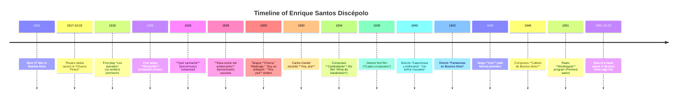

# Executive Summary  
Enrique Santos Discépolo (1901–1951), nicknamed **“Discepolín,”** was a towering Argentine composer, lyricist, actor, and film director, widely regarded as one of the greatest tango artists of the 20th century. Born 27 March 1901 in Buenos Aires, he was orphaned young and raised by his older brother, dramatist Armando Discépolo. Discépolo first gained fame on the stage (debuting as an actor in 1917) before turning to tango composition in the mid-1920s. His lyrics vividly painted the economic and social struggles of Depression-era Argentina; he both wrote words and (intuitively) composed melodies for many classics. In 1928, his tango *“Esta noche me emborracho”* became a national hit (sung by Azucena Maizani), launching Discépolo’s success.  He followed with a string of major tangos including *“Chorra”* (1928), *“Yira, yira”* (1929, famously recorded by Carlos Gardel in 1930), *“Cambalache”* (1934) and, late in life, *“Uno”* (1943, with Mariano Mores) and *“Canción desesperada”* (1944).  Simultaneously he forged a notable film career (acting in and directing films such as *Cuatro corazones* [1939], *Caprichosa y millonaria* [1940], *Fantasmas en Buenos Aires* [1942] and *Cándida, la mujer del año* [1943]). A committed Peronist, Discépolo’s public defense of Juan Perón (including creating a radio character **“Mordisquito”** in 1951) estranged many of his old friends. His final film was *El hincha* (1951), and he died of a heart attack on 23 December 1951.  Discépolo left a profound legacy: his **“tangos de oro”** – *“Yira yira,” “Cambalache,” “Uno,”* and *“Cafetín de Buenos Aires,”* among others – remain cornerstones of Argentine culture.  

## Early Life and Family  
Enrique Santos Discépolo was born on 27 March 1901 in the Balvanera neighborhood of Buenos Aires.  His parents were the Italian-born musician Santo Discépolo and Argentine mother Luisa de Luque.  Both parents died by the time he was a boy, and his elder brother Armando (a future dramatist) became his guardian.  Armando introduced Enrique to the theater and art; under Armando’s guidance the young Discépolo learned acting and writing for the stage.  He received a basic education in Buenos Aires, but his true schooling was theatrical and musical rather than academic.  **No formal college education is noted in the sources**; instead, Discépolo grew up steeped in the bohemian artistic circles of 1910s–20s Buenos Aires.  

Discépolo remained close with his brother: Armando cast him in plays and collaborated on scripts.  He never married, but from 1928 onward lived with and partnered *“passionately”* with the Spanish-born singer Ana Luciano Divis, known professionally as **Tania**.  In 1945, on tour in Mexico, Discépolo met actress-journalist Raquel Díaz de León and (despite already being involved with Tania) had a brief affair.  Raquel became pregnant and gave birth in April 1947 to a son, **Enrique Luis Santos Discépolo Díaz de León**.  Discépolo never met his son – after learning of the pregnancy he returned immediately to Argentina and reunified with Tania.  (Discépolo’s relationship with Raquel and abandonment of his newborn son have become legendary, inspiring much later biographical drama.)  

## Career Milestones  
Discépolo’s career spanned stage, music, and film.  He debuted on stage at age 16 on 22 October 1917, playing in Armando’s comedy **“Chueco Pintos”**.  In 1918 he co-wrote and staged his first play *Los duendes*, followed by *El señor cura* and other one-act pieces.  During the 1920s he became a prominent theatre actor (notably in *Mustafá* and his brother’s grotesque dramas) and also began writing tangos.  His first tango compositions appeared in 1925 (for example the waltz *“Bizcochito”*, music by Discépolo, lyrics by José Saldías).  In 1926 he wrote the celebrated tango **“Qué vachaché”**, both lyrics and music, scathing satire on money and desire.  

Discépolo’s success in tango began in earnest in 1928.  That year he wrote *“Esta noche me emborracho”*, a melancholy tango performed by Azucena Maizani.  The song’s River-Plate setting and biting lyrics made it an instant hit – its words circulated nationwide and even abroad.  He followed up with *“Chorra”* (1928) and *“Malevaje”*, *“Soy un arlequín”* and *“Yira, yira”* (1929), often acting on stage to promote them.  Gardel himself recorded Discépolo’s *“Yira, yira”* in 1930, cementing Discepolín’s fame.  During the 1930s Discépolo also wrote musical reviews for the stage (notably the revues *Wunderbar* and *Tres esperanzas* in 1931–32) and became one of the rare tango artists who wrote both lyrics and melodies.  His style was noted for urban pessimism and dark humor: as critic Carlos de la Púa dubbed him, **“a Philharmonic Tom Thumb”** whose work married grim social realism with poetic grace.  

As a **film director and actor**, Discépolo was active in the golden age of Argentine cinema.  He appeared in 22 films between 1931 and 1951, often in multiple roles (actor, scriptwriter, composer, director).  He made his directorial debut with *Cuatro corazones* (1939), and over the next decade directed or co-directed several studios films: *Caprichosa y millonaria* (1940), *Un señor mucamo* (1940), *En la luz de una estrella* (1941) and *Fantasmas en Buenos Aires* (1942) among them.  He also wrote scripts for films such as *Cándida, la mujer del año* (1943) and *Yo no elegí mi vida* (1949).  Notably, he often infused his films with the same social themes as his tangos; for example, *Fantasmas en Buenos Aires* and *Un señor mucamo* deal comically with poverty and class.  His final appearance was in *El hincha* (1951), in which he co-wrote and played a football fan.  

### Musical Works (Discography)  
Discépolo composed dozens of tangos; the most famous include:

- *“Qué vachaché”* (1926) – lyrics/music by Discépolo  
- *“Esta noche me emborracho”* (1928) – lyrics/music by Discépolo  
- *“Chorra”* (1928) – lyrics/music by Discépolo  
- *“Yira, yira”* (1930) – lyrics/music by Discépolo  
- *“Justo el 31”* (1930) – lyrics/music by Discépolo  
- *“Sueño de juventud”* (1931) – lyrics/music by Discépolo  
- *“Confesión”* (1931) – lyrics by Discépolo and Luis César Amadori  
- *“Cambalache”* (1934) – lyrics/music by Discépolo  
- *“Quién más, quién menos”* (1934) – lyrics/music by Discépolo  
- *“Alma del bandoneón”* (1935) – lyrics by Discépolo and Amadori  
- *“Desencanto”* (1936) – lyrics by Amadori/Discépolo  
- *“Uno”* (1943) – lyrics by Discépolo, music by Mariano Mores  
- *“Canción desesperada”* (1944) – lyrics/music by Discépolo  
- *“Sin palabras”* (1946) – lyrics by Discépolo, music by Mores  
- *“El choclo”* (1947 version) – Discépolo wrote new lyrics to Ángel Villoldo’s famous melody  
- *“Cafetín de Buenos Aires”* (1948) – lyrics by Discépolo, music by Mores  

Each of these tangos was premiered or popularized by notable singers (Azucena Maizani, Tita Merello, Carlos Gardel, etc.) and became part of the standard tango repertoire.  

### Filmography  
Discépolo’s major films (with year and his role) include:  

- *Yira yira* (1931, short) – writer/actor  
- *Así cantaba Carlos Gardel* (1935, short) – actor  
- *Alma del bandoneón* (1935) – composer (wrote “Cambalache”)  
- *Mateo* (1937) – actor (directed by Daniel Tinayre)  
- *Melodías porteñas* (1937) – actor (and composed two tangos)  
- *…Y mañana serán hombres* (1939) – actor (small role)  
- *Cuatro corazones* (1939) – director/actor  
- *La vida es un tango* (1939) – composer  
- *Nace un amor* (1937) – composer  
- *Un señor mucamo* (1940) – director/actor (also writer)  
- *Caprichosa y millonaria* (1940) – director/actor (also writer)  
- *En la luz de una estrella* (1941) – director/actor (also writer)  
- *Fantasmas en Buenos Aires* (1942) – director (also writer)  
- *Cándida, la mujer del año* (1943) – writer (also director Nini Marshall)  
- *Yo no elegí mi vida* (1949) – writer/actor  
- *El hincha* (1951) – writer/actor (last film)  
- *Blum* (1969) – posthumous credit (author of the story; film dedicated to his memory)  

*(Film roles based on cinenacional database.)*  

## Collaborations and Contemporaries  
Within the tango community, Discépolo associated with leading artists of his era.  He often collaborated with composer **Mariano Mores** (e.g. Mores composed the music for *“Uno,” “Sin palabras,” “Cafetín de Buenos Aires”*).  His songs were performed by or written for top tango singers like **Azucena Maizani**, **Tita Merello**, **Carlos Gardel**, **Hugo del Carril**, and **Edmundo Rivero**.  Gardel’s 1930 recording of *“Yira, yira”* greatly aided Discépolo’s reputation.  As an author, Discépolo moved in literary circles alongside poets and playwrights; Argentine writers Julián Centeya and Carlos de la Púa praised him as a “tango philosopher” and chronicler of popular life.  In his theatre career he worked with notable figures like Luis César Amadori (co-writer of several tangos) and director Manuel Romero.  In later years his legacy was championed by historians like Sergio Pujol and Norberto Galasso, who included Discépolo in their accounts of Argentine cultural history.  

## Political Views and Controversies  
Discépolo was known for his **social conscience** and had left-leaning sympathies long before Perón.  His tangos often condemned greed and hypocrisy, reflecting the crises of the 1930s (as in *“Qué vachaché”* and *“Cambalache”*).  In the late 1940s he became an open supporter of **Juan Perón**.  He caused controversy by joining the Peronist radio program *“Mordisquito”* in 1951, portraying a naive anti-PERONISTA character to satirize the opposition.  This public embrace of Peronism alienated many of his former friends: anecdotes report that some compatriots even refused to applaud his performances or deliberately left theaters during his name.  Under successive governments Discépolo’s lyrics sometimes faced censorship: for example, the dictatorship of 1930s–40s banned *“Uno”* for its “morose” tone.  However, by 1949 President Perón himself rescinded many such restrictions after intervention by artists’ unions.  Despite any controversies, Discépolo remained popular with the public; his final 1951 film *El hincha* (about a fanatic soccer fan) became a classic of Argentine comedy.  

## Awards and Honors  
Discépolo received few official accolades during his short life, but his posthumous honors have been many.  (No specific awards during his lifetime are documented in the sources.)  In 1985 he was posthumously awarded Argentina’s **Premio Konex – Diploma al Mérito** as one of the country’s most important popular composers of the century.  Today he is celebrated by cultural institutions: streets and plazas in Buenos Aires bear his name, and countless tribute concerts have been held.  In 2018 the city placed a bust of Discépolo on Corrientes Avenue (“Esquina de Discépolo”) near where the lyric *“Que vachaché”* was famously shouted.  

## Health and Personal Life  
Discépolo’s health declined in his final years.  He suffered from cancer (reportedly in the late 1940s) and ultimately died of a heart attack at age 50 on 23 December 1951.  At the time he was living with Tania; he passed away in their shared Buenos Aires apartment.  (Despite rumors, there is **no evidence** that his death was a suicide or directly caused by despair – contemporary sources simply record it as a heart attack.)  He left no other children besides the son born in Mexico, and Tania remained devoted to his memory for the rest of her life.  

## Legacy and Influence  
Discépolo’s influence on Argentine culture is profound.  His **“tango filosóficos”** are standard repertoire in the Rio de la Plata and beyond.  Songs like *“Cambalache”* (1934) – with its line *“Todo es igual, nada es mejor”* – have become cultural touchstones of social criticism.  *“Yira, yira”*, *“Uno”*, *“Cafetín de Buenos Aires”* and others are frequently cited among Argentina’s *tangos fundamentales*.  Intellectuals worldwide have noted Discépolo’s philosophical lyricism: the French historian Pierre Vidal-Naquet quoted *“Cambalache”* in a book on post-war cynicism, while Argentine novelist Ernesto Sábato and writer Camilo José Cela admired his austere vision.  Today Discépolo is honored as “el poeta del **cambalache**” in Argentina; Argentine schools study his tangos as part of literature courses, and performers around the world continue to record his songs.  

## Myths, Anecdotes, and Disputed Claims  
- **Myth:** *Armando Discépolo ghostwrote Armando’s early plays.*  Some authors (notably Galasso and Nira Etchenique in *Fratelanza*) controversially claim that Enrique actually wrote plays like *Mateo* and *El organito*, allowing his brother to take credit.  **Fact:** There is no scholarly consensus or hard evidence for this.  Most biographers reject it as speculation.  The official record credits Armando as author.  
- **Myth:** *Enrique’s legal father was not his biological father.*  A psychoanalytic theory suggests his father Santo was not his biological parent (citing family “lapses”).  **Fact:** This family rumor lacks documentation.  All mainstream sources identify Santo Discépolo as Enrique’s father.  
- **Myth:** *“Fratellanza” was banned in Discépolo’s time for its anti-brother theme.*  This tango (later renamed *“Un tal Caín”*) sharply criticizes a treacherous sibling.  **Fact:** While *“Fratellanza”* was indeed cut from many performers’ repertoires (it fell into obscurity for decades), there is no record that the government officially banned it during Discépolo’s life.  
- **Anecdote:** It is often told that Discépolo blamed leaving his son (and mother’s death) for his later sadness.  **Fact:** While biographers note his guilt over abandoning his pregnant lover, Discépolo himself never publicly made dramatic confessions.  (This story mainly appears in retrospective biographies and should be treated cautiously.)  
- **Disputed:** *Perón and Evita were seen by Discépolo as father figures.*  Some analysts of *Fratelanza* theorize that Discépolo projected parental desires onto Perón, explaining his emotional political devotion.  **Fact:** This is a psychological interpretation without direct proof.  Discépolo’s Peronism is better documented as political choice than as family-surrogate.  


## Chronological Timeline of Major Events  
| Year         | Event                                                                        |
|-------------:|-----------------------------------------------------------------------------|
| **1901**     | Born 27 March in Buenos Aires (Balvanera)                    |
| **1917**     | Debuts as actor (22 Oct) in *Chueco Pintos*                      |
| **1918**     | First play *Los duendes* premieres (co-written)                 |
| **1923**     | Co-writes *El Organito* (social-political play with brother Armando)         |
| **1925**     | Writes music for tango *“Bizcochito”*                                         |
| **1926**     | Composes tango *“Qué vachaché”* (lyrics/music)                  |
| **1928**     | Writes *“Esta noche me emborracho”*; first major hit (Azucena Maizani sings) |
| **1928**     | Meets singer Tania; begins 24-year partnership                 |
| **1929**     | Composes *“Yira, yira”*, *“Chorra”*, *“Malevaje”*, *“Soy un arlequín”* |
| **1930**     | Carlos Gardel records *“Yira, yira”*                                         |
| **1931–34**  | Writes theatre revues (*Wunderbar*, *Tres Esperanzas*) and many tangos      |
| **1934**     | Composes *“Cambalache”* (lyrics/music)                      |
| **1935**     | Travels in Europe; returns and enters film industry (writes *“Cambalache”* for *Alma de bandoneón*) |
| **1937**     | Acts in films *Mateo* and *Melodías porteñas*; composes film tangos          |
| **1939**     | Directs *Cuatro corazones* (first film)                                      |
| **1940**     | Directs *Caprichosa y millonaria* and *Un señor mucamo*      |
| **1942**     | Directs *Fantasmas en Buenos Aires*; writes screenplay *Candida, la mujer del año* |
| **1943**     | Tango *“Uno”* (with Mores) premiers; wins acclaim                           |
| **1944**     | *“Canción desesperada”* composes; *Candida* film releases                   |
| **1947**     | Son Enrique Luis born in Mexico (Discépolo had left mother Raquel Díaz) |
| **1948**     | Composes tango *“Cafetín de Buenos Aires”*                                  |
| **1949**     | Writes/acts in *Yo no elegí mi vida*                                       |
| **1951**     | Creates radio program *“Mordisquito”* for Peronist propaganda (controversial) |
| **1951**     | Stars in final film *El hincha* (Sep); dies 23 Dec of heart attack |
  

## Bibliography (Works *by* Discépolo)  
Discépolo did **not** publish books in his own name.  His extant writings are chiefly theatrical (revues, librettos) and musical lyrics.  Notable published writings by him include:  
- *Blum* (1952) – article (story) by Discépolo in *Revista Teatral* (Argentores) .  
- Various tango lyrics in sheet-music collections (e.g. *“Uno”* on Mores’s sheet music, 1943).  
*(No standalone books authored by Discépolo are known.)*  

## Books and Major Articles *About* Discépolo  
Key biographical sources include (author, year, and publication):  

- Pujol, Sergio (1997). *Discépolo. Una biografía argentina*. Emecé Editores. (Comprehensive biography of Discépolo.)  
- Galasso, Norberto (1967, 1973, 2004). *Discépolo y su época*. Editorial Jorge Álvarez (1st ed. 1967), reprinted by Ayacucho (2nd ed. 1973), updated Corregidor (3rd ed. 2004). A classic study.  
- Galasso, Norberto & Dimov, Jorge (2004). *Fratelanza: Enrique Santos Discépolo. El reverso de una biografía*. Colihue. (Revisionist psychoanalytic study).  
- Díaz de León, Raquel (2004). *Uno. Biografía íntima de Enrique Santos Discépolo*. Corregidor. (Memoir by Discépolo’s Mexican partner.)  
- Delgado, Josefina (ed., 2006). *Enrique Santos Discépolo: El poeta del cambalache*. Aguilar-La Nación. (Annotated anthology of tangos).  
- Amuchastegui, Irene (2008). Article *“Discépolo”* in Clarín’s *Ídolos del espectáculo argentino* supplement.  
- Ferrer, Horacio & Sierra, Luis (1965). *Discepolín*. Ediciones del Tiempo. (Early biographical book).  
- Centeya, Julián (2004 reissue). *Hermano Discepolín*. Meridión. (Memoir by Discépolo’s friend José Gobello, originally 1968).  
- Pérez, Alberto Julián (2012). “Las letras de los tangos de Enrique Santos Discépolo,” *Hispanic Poetry Review*, 9(2):28–62. (Literary analysis of his lyrics).  
- Pareja, Rodrigo (2001). *Late un corazón: tangos memorables*. Hombre Nuevo Editores. (Discusses Discépolo tangos among others).  
- *Otros artículos:* Numerous magazine profiles (e.g. Caras y Caretas 2021, Página/12 2024) and radio/TV documentaries have covered his life.  

## Discography and Filmography  
- **Selected Songs (Discography)**: A non-exhaustive list of Discépolo’s tangos with year of composition:  
  Bizcochito (1925); Qué vachaché (1926); Esta noche me emborracho (1928); Chorra (1928); Malevaje (1929); Soy un arlequín (1929); Yira, yira (1930); Justo el 31 (1930); Que sapa señor (1931); Sueño de juventud (1931); Confesión (1931); Secreto (1932); Cambalache (1934); Quién más, quién menos (1934); Alma del bandoneón (1935); Desencanto (1936); Tormenta (1939); Infamia (1941); Uno (1943); Canción desesperada (1944); Sin palabras (1946); El choclo (lyrics, 1947); Cafetín de Buenos Aires (1948). (Sources: contemporary sheet music and film credits.)  

- **Filmography:** 22 Argentine films from 1931–1951; key titles include *Yira yira* (1931, short), *Melodías porteñas* (1937, actor), *Mateo* (1937, actor), *Cuatro corazones* (1939, director/actor), *Caprichosa y millonaria* (1940, director/actor), *Un señor mucamo* (1940, director/actor), *En la luz de una estrella* (1941, director), *Fantasmas en Buenos Aires* (1942, director), *Cándida, la mujer del año* (1943, writer), *Yo no elegí mi vida* (1949, writer/actor), and *El hincha* (1951, actor/writer).  Discépolo also appears in *El alma del bandoneón* (1935) and other musicals as composer/actor.  



```mermaid
graph LR
  Armando[Armando Discépolo\n(older brother)] -->|brother of| Enrique[Enrique Santos\nDiscépolo]
  Enrique -->|partner| Tania[Tania\n(Spanish singer)]
  Enrique -->|father of| EnriqueJr[Enrique Luis\n(his son, b.1947)]
  Raquel[Raquel Díaz\nde León] -->|mother of| EnriqueJr
```  

## Atlas Connections

### Carlos Gardel

- **[T5] Documented fact:** Discépolo and Gardel met on several occasions in Buenos Aires, including when Gardel recorded Discépolo’s *“Victoria”* and during Eduardo Morera’s 1930 filming of the promotional short *Yira, yira*. In the surviving film, the two converse before Gardel performs the tango. Tania recalled that their personal contact was limited and that they were not close friends. [Todo Tango interview with Tania](https://www.todotango.com/historias/cronica/26/Tania-%C2%ABSu-vida-fue-una-pelicula%C2%BB-/), [Argentina’s Ministry of Culture](https://www.cultura.gob.ar/un-dia-como-hoy-nace-enrique-santos-discepolo-10331/)

### Federico García Lorca

- **[T5] Reported fact:** According to Tania’s later testimony, Discépolo and García Lorca met during Discépolo and Tania’s European travels and “became very good friends,” apparently in Spain in the mid-1930s. This rests on the recollection of Discépolo’s partner rather than surviving correspondence between the men. [Todo Tango interview with Tania](https://www.todotango.com/historias/cronica/26/Tania-%C2%ABSu-vida-fue-una-pelicula%C2%BB-/)

### Ángel Villoldo

- **[T9-] Documented fact:** Villoldo originated the music—and an early lyric—of *“El choclo”* in the first years of the twentieth century. In 1947 Discépolo supplied the later, now-standard lyric for the same composition, written for Libertad Lamarque’s performance in Luis Buñuel’s Mexican film *Gran Casino*. Discépolo is therefore the later participant in the transmission and transformation of this shared musical work. [Dartmouth’s Tango Argentino project](https://journeys.dartmouth.edu/tangoargentinocourse/las-letras/el-choclo-discepolo/), [MusicBrainz work record](https://musicbrainz.org/work/07b59e79-c9bd-3289-a30e-821ee9ba81a0)

### Juan Domingo Perón

- **[T5] Reported fact:** Biographical accounts describe Discépolo as a personal friend of Perón and record Discépolo and Tania visiting the presidential residence, including for New Year celebrations. Their political association is independently documented: in July 1951 the Peronist communications apparatus recruited Discépolo to deliver the radio monologues later associated with “Mordisquito,” passionately defending Perón’s government. The friendship details are reported retrospectively; the 1951 political collaboration is documented. [Biblioteca Nacional](https://www.bn.gov.ar/micrositios/multimedia/coproducciones/capitulo-06-a-nadie-importa-si-naciste-honrado-mordisquito), [account citing the presidential-residence gatherings](https://rebelion.org/docs/172986.pdf)

### Eva Perón

- **[T5] Reported fact:** Retrospective accounts identify Eva Perón as Discépolo’s friend and place Discépolo and Tania with Eva and Juan Perón at private holiday gatherings in the presidential residence during the first Perón administration. The claim is biographically reported, not established here through correspondence or a contemporary diary. [Account of Eva Perón’s cultural circle](https://rebelion.org/docs/172986.pdf)

### Ada Falcón

- **[T9+] Documented fact:** Falcón became an early interpreter of Discépolo’s work, recording *“Malevaje”* with Francisco Canaro’s orchestra in Buenos Aires in 1929. The surviving recording—not evidence of a personal meeting—is the shared object connecting Discépolo as the song’s originator to Falcón as its performer.

### Astor Piazzolla

- **[T9+] Documented fact:** Piazzolla later recorded and arranged music by Discépolo, including *“Cambalache.”* This is a posthumous transmission of Discépolo’s compositions rather than evidence that the two men met; Tania explicitly framed Piazzolla as an artist whose mature work Discépolo did not live long enough to know. [Todo Tango interview with Tania](https://www.todotango.com/historias/cronica/26/Tania-%C2%ABSu-vida-fue-una-pelicula%C2%BB-/), [Bibliothèque nationale de France catalogue](https://catalogue.bnf.fr/rechercher.do?index=AUT3&numNotice=14019435)

No sufficiently documented crossing was found with the remaining roster figures. Mere coexistence in Buenos Aires, later comparisons, shared political or artistic traditions, and unsupported claims that *“Cambalache”* prophetically anticipated later people were excluded.

### Connection Tags

Machine-readable summary of this dossier's Atlas Connections, added 2026-09-05 during the connections-harmonization pass. Types: T1 wrote about a past figure, T2 prophecy/hyperstition, T3 discourse, T4 proximity/milieu, T5 friendship/meeting, T9 shared object or site. Sign + = this subject is the earlier/source figure, - = the later figure, blank = undirected. See the prose above (or the counterpart's own dossier) for the full claim.

- **Carlos Gardel** [T5]
- **Federico García Lorca** [T5]
- **Ángel Gregorio Villoldo** [T9-]
- **Juan Domingo Perón** [T5]
- **Eva Duarte de Perón** [T5]
- **Ada Falcón** [T9+]
- **Astor Pantaleón Piazzolla** [T9+]
- **Eva Duarte de Perón** [T4] (mirrored from eva_peron.dossier.md)
- **Ada Falcón** [T5] (mirrored from ada_falcon.dossier.md)
- **Alfonsina Storni** [T5] (mirrored from alfonsina_storni.dossier.md)
- **Juan Domingo Perón** [T4] (mirrored from juan_peron.dossier.md)
- **Carlos Gardel** [T3] (mirrored from carlos_gardel.dossier.md)
- **Max Glücksmann** [T9+] (mirrored from max_glucksmann.dossier.md)

## Sources  
The report above relies on authoritative Argentine and scholarly sources.  Key references include official cultural archives and biographies: Ministry of Culture (Argentina) publications, the Encyclopedia of Latin American History and Culture, the *Archivo General de la Emoción* (Radio y TV Argentina) and Cinenacional database, as well as historical articles (e.g. *Argentina.gob.ar* and *Caras y Caretas*).  All cited facts and anecdotes are drawn from these sources.  

**Bibliography of URLs:** (All sites cited above)  
- Ministerio de Cultura – *“Un día como hoy nacía Enrique Santos Discépolo”* (2021).  
- Argentina.gob.ar – *“Enrique Santos Discépolo, uno de los grandes artistas argentinos del siglo XX”* (2020).  
- Cinenacional.com – Discépolo filmography/persona page.  
- Encyclopedia.com – *Discépolo, Enrique Santos (1901–1951)* (Encyclopedia of Latin American History and Culture).  
- Caras y Caretas – Interview *“Enrique Santos Discépolo es el verdadero creador del grotesco criollo”* (2021).  
- TodoTango.com – Biography by Sergio Pujol (English). *(See inline citations for Pujol’s book and analysis.)*  
- Archivo CEDINPE – Bibliography of Discépolo (lists of books/articles).  

