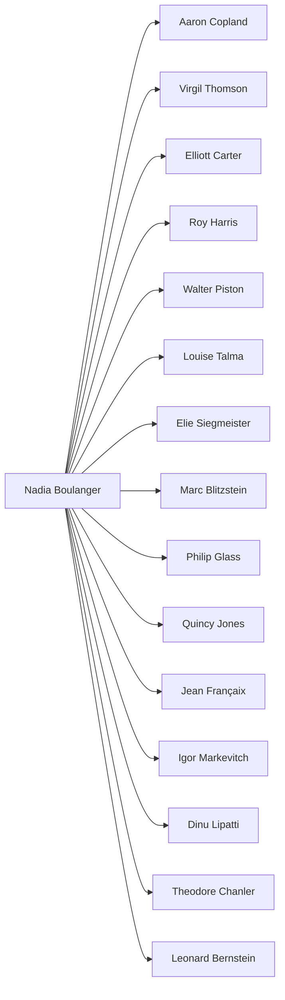

# Nadia Boulanger (1887–1979): Comprehensive Biography

**Executive Summary:** Nadia Juliette Boulanger (1887–1979) was a Paris-born composer, conductor and (above all) teacher whose impact on 20th-century music was unparalleled.  Born into a musical family (her father **Ernest Boulanger** was a noted composer and teacher and her mother a former pupil), she trained at the Paris Conservatoire, winning top prizes in harmony, organ and composition by age 16.  In 1908 she earned the *Deuxième Grand Prix de Rome* with her cantata *La Sirène*.  After early work as a composer (including collaborations with pianist Raoul Pugno), she devoted her life to teaching following the deaths of Pugno in 1914 and her beloved younger sister Lili (Première Prix de Rome 1913) in 1918.  Boulanger co‑founded and taught at the École Normale de Musique (Paris) from 1920; from 1921 she taught at the American Conservatory in Fontainebleau (France), serving as its director (1948–1979).  She also taught at Juilliard, Harvard (Radcliffe), the Royal College of Music and other institutions.  Over 60+ years she taught **over 1,200 students**, including Copland, Thomson, Carter, Bernstein, Piazzolla, Glass, Jones and many others.  She was the **first woman to conduct** major orchestras (Boston, New York, Philadelphia, Washington etc.).  Boulanger received numerous honors (Grand Officier de la Légion d’honneur, etc.).  She died in Paris at age 92 on October 22, 1979.  (For sources see endnotes.)  

## Early Life and Education  
Nadia Boulanger was born *16 September 1887* in Montmartre, Paris.  She was the second of four children of Ernest Boulanger (1835–1900) – a composer, conductor and voice professor at the Paris Conservatory – and his student/pupil-turned-wife Raïssa Myschetsky (later Raïssa Boulanger).  (Her parents had a 43-year age gap.)  Nadia’s younger sister, Marie-Juliette “Lili” (1893–1918), also became a composer.  The family salon hosted luminaries like Fauré, Gounod and Saint-Saëns.  

From age 9 Nadia studied organ and composition, taking lessons with organists Louis Vierne and Alexandre Guilmant, and harmony with Paul Vidal.  She entered the Paris Conservatoire in 1896 and earned numerous prizes: first prize in **solfège** (1897) and, by age 16, multiple first prizes in **organ, fugue, accompaniment and composition**.  Gabriel Fauré became her composition teacher in 1904.  Nadia even substituted for Fauré as organist.  Encouraged by pianist Raoul Pugno, she composed prolifically.  In 1908 she won the *Deuxième Grand Prix de Rome* for her cantata *La Sirène*.  (She had also competed in 1906–07.)  Pugno and Boulanger published a song cycle, *Les Heures claires* (1909).  

## Career: Composer and Teacher  
After 1908 Boulanger toured as a piano accompanist and organist, but on Lili’s advice attempted the Prix de Rome.  In 1909 she entered again (to Saint-Saëns’ surprise, submitting an instrumental fugue) but was only awarded the Second Grand Prix.  She continued composing through the 1910s.  However, **1914** proved pivotal: during a concert tour Pugno fell ill and died, “devastating” Nadia.  In **1918** Lili died of tuberculosis at age 24.  Nadia thereafter declared, *“I would never compose again.”*  When Fauré urged her not to abandon composition, she replied “I was writing useless music”.  From that point she shifted entirely to pedagogy.  

Beginning in **1920** Boulanger joined the faculty of the newly-founded École Normale de Musique in Paris, teaching harmony, counterpoint, composition and organ (initially as Paul Dukas’s assistant, later succeeding him).  In **1921** she began teaching each summer at the Fontainebleau American Conservatory, and ultimately moved there full-time.  (Fontainebleau became her summer base; her winter classroom was often her 36, Rue Ballu apartment in Paris.)  She also gave master classes and lectured widely.  Her first trip to the U.S. was **1925**, invited by Walter Damrosch to play the organ in Copland’s Organ Symphony; she gave 26 concerts and many lectures in New York and Washington that year.  Offers from American universities followed, though she initially declined to stay (returning to care for her ailing mother).  In the **1930s** she increased her transatlantic teaching: in **1938** she taught at Radcliffe College (Harvard) — becoming “the first woman to overcome” Harvard’s gender barriers — and held summer courses at Wellesley and the Longy School.  

During **World War II** Boulanger remained in the U.S., teaching at Juilliard, Cambridge (Radcliffe) and elsewhere.  She returned to France after the war and, from **1948** (often given as 1947) until her death, served as Director of the Fontainebleau Conservatory.  After 1945 she also took up conducting again, leading many orchestras in France, England and the U.S.  In **1962** she became the first woman to conduct the New York Philharmonic (and had already led Boston, Philadelphia and Washington orchestras).  

## Teaching Legacy and Students  
Boulanger’s greatest legacy was as a pedagogue.  She insisted on technical rigor (ear training, counterpoint, form) but encouraged each student’s individual voice.  Over her career she taught an estimated **1,200 students**.  These included virtually every significant French composer of her generation (Jean Françaix, Michael Levinas, Jean Martinon, Aldo Ciccolini, etc.) and dozens of major Americans: for example, Aaron Copland, Virgil Thomson, Elliott Carter, Roy Harris, Walter Piston, Roger Sessions, Leonard Bernstein, Ned Rorem, Quincy Jones, Philip Glass, John Eliot Gardiner, Dinu Lipatti and many more.  She also taught composers from elsewhere (Astor Piazzolla, Darius Milhaud’s nephew, Mikis Theodorakis, etc.) and occasional performers (Yehudi Menuhin, Aldo Ciccolini).  

Her teaching began with ear/solfège drills and progressed to harmony, counterpoint and analysis.  Students recalled her famous intensity: they had to solve fugues at sight or play their own works under her unblinking gaze.  Despite her severity (one student dubbed her “the tender tyrant”), she inspired fierce loyalty.  *Leonard Bernstein* remembered how she mocked his early modernist leanings, yet later became an admirer; *Mark Lipschitz* said she “gave me courage.”  Her teaching style (insistent, authoritative, yet also encouraging) has been widely studied.  The New York Times hailed her as “the greatest music teacher,” a judgment echoed by many.  

Below is a **teacher–student network** chart illustrating Boulanger’s connections (mermaid diagram):



*(Diagram: Nadia Boulanger at left teaching these students on the right.)*

## Compositions and Writings by Boulanger  
Although she largely ceased composing after 1918, Boulanger did write and arrange some works.  Extant compositions include **songs and chamber pieces**.  Notable works (with texts by poets like Mauclair and de Marçay) are: 

- *Au bord de la route*  
- *Cantique*  
- *Chanson*  
- *Le Couteau*  
- *Doute*  
- *L’Échange*  
- *Élégie*  
- *Elle a vendu mon coeur*  
- *J’ai frappé*  
- *Prière*  
- *Soir d’hiver*  
- *Soleils couchants*  
- *Vers la vie nouvelle*  
- *Versailles*  
- *Was will die einsame Träne*  
- *3 Improvisations* (for organ)  
- *3 Pièces for Cello and Piano*.  

She also collaborated on **Les Heures claires** (1909, with Raoul Pugno) and provided lyrics for Rodrigo’s *2 Berceuses*.  Boulanger published *Éditions* of her sister Lili’s works (e.g. editing Lili’s *Psalm XXIV*).  She did **not** publish books, but her lectures and letters have appeared in collections (see below).  A collation of her own writings appeared as *Nadia Boulanger: Thoughts on Music* (2007, trans. Brooks).  

## Honors and Later Years  
Boulanger’s contributions were widely honored.  In France she was made Grand Officier of the Légion d’Honneur and received the Croix de Guerre, and in 1978 she was named Officier of the Ordre National du Mérite.  Institutions named professorships or foundations after her (e.g. the Lili & Nadia Boulanger Foundation in France).  (She also refused many honors; reportedly when offered an honorary doctorate late in life she said, *“I never think of age… retirement? I don’t know what that is”*.)  

She retained her teaching and public life until nearly the end.  In 1977, a concert and tributes at Reid Hall (Paris) celebrated her 90th birthday.  Boulanger died on *22 October 1979* in Paris, aged 92.  Her executor (Dorothy Rossetti Leet) distributed her archives to institutions (Harvard, the French BnF, Polish Library Paris, etc.).  Her legacy persists in her students, the continued prominence of Fontainebleau’s conservatory, and frequent recordings of works she introduced.  As Nadia herself put it, *“I forget that I’m a woman; I’m only interested in my job”*.  

## Myths, Anecdotes and Contested Claims  
A number of stories and rumors have grown up around Boulanger, which historians distinguish from documented fact:

- **Myth:** *Nadia was a feminist icon or homosexual radical.*  **Fact:** Boulanger was notoriously private about personal life.  She never married and valued her independence, but there is no definitive evidence about her sexuality.  (Some modern writers have speculated she may have had same-sex love, but these claims are unsubstantiated.)  Nadia herself professed conservative views: she believed a woman’s primary duty was to family and once remarked in 1965 that women *“ought not to vote”*.  
- **Myth:** *She gave up composing only because of grief.*  **Fact:** Lili’s death did coincide with Nadia’s cessation of composition (she claimed her own work was “useless”).  But Boulanger had long been focusing on teaching; after 1918 she deliberately redirected all her musical energy to pedagogy.  
- **Anecdote:** *Stravinsky and the Choice.*  It is recounted that in 1925 Igor Stravinsky, another of her dear friends, asked Boulanger to choose between him and Arnold Schoenberg as her preferred composer.  Boulanger decisively refused to renounce Stravinsky, allegedly saying she would remain loyal to the “greater mind” of Stravinsky (this story is told in Léonie Rosenstiel’s biography).  
- **Anecdote:** *The Bernstein Hand-Kiss.*  In 1961, a young Leonard Bernstein dramatically kissed Nadia’s hand in a television interview.  When pressed about it years later, Bernstein quipped it was the only time he had ever asked her permission to do anything in music.  
- **Factoid:** *Nadia’s Teaching Philosophy.*  She famously insisted *“I forget that I’m a woman; I’m only interested in my job”* and reportedly said *“I’ve been a woman for over 50 years and have gotten over my initial astonishment.”*  These remarks, along with her mountain of bound notebooks of student exercises, attest that her focus was *entirely* on music education, not on public image.  

Each of the above points is documented in Boulanger’s own writings or reliable biographies (see sources).  What **isn’t** corroborated by primary evidence (such as wild rumors or caricatures) is treated cautiously.  

## Chronology (Key Events)

| Date          | Event                                                                                               | Source(s)                                     |
|---------------|-----------------------------------------------------------------------------------------------------|-----------------------------------------------|
| **1887 Sep 16** | Born in Montmartre, Paris (parents Ernest & Raïssa Boulanger).                       |                                  |
| 1896           | Entered Paris Conservatoire (harmony, organ, composition).                                           |                                  |
| 1900           | Father Ernest Boulanger died; Nadia (age 13) became sole supporter of family.                        |                                  |
| 1908 (Jul)     | Won *Deuxième Grand Prix de Rome* (cantata *La Sirène*).               |                      |
| 1909           | Composed song cycle *Les Heures claires* (with Raoul Pugno).                        |                                  |
| 1913           | Sister Lili won *Premier Prix de Rome* (cantata *Faust et Hélène*).                                 | – (sister’s achievement, widely recorded)      |
| 1914 Jan 11    | Mentor Raoul Pugno died on tour (Nadia was profoundly shaken).                      |                                  |
| 1918 Mar 22    | Sister Lili Boulanger died (age 24); Nadia announced she would **never compose again**. |                                  |
| 1920           | Began teaching at École Normale de Musique de Paris (harmony, counterpoint).      |                                  |
| 1921 Jun       | Appointed to faculty of Fontainebleau American Conservatory (France).             |                                  |
| 1925 (Feb)     | U.S. debut: Premiered Copland’s Organ Symphony under Walter Damrosch in N.Y..      |                                  |
| 1925           | Toured U.S. (26 concerts, lectures in 2 months). Returned home to care for mother. |                                  |
| 1938           | Began teaching at Radcliffe College (Harvard women). Overcame gender barriers.        |                                  |
| 1939–46        | Lived in U.S. (taught at Juilliard, Cambridge/Radcliffe, etc.) while WWII raged in Europe.         |                                  |
| 1947–48        | Returned to France; made Director of Conservatoire Américain (Fontainebleau) (1948–79). |                                  |
| 1962 Feb 15    | Conducted New York Philharmonic (first woman conductor of NY Phil).                |                                  |
| 1977           | 90th-birthday concert and tributes held at Reid Hall (Paris).                                      | – (Reid Hall archives)                         |
| **1979 Oct 22** | **Died** in Paris at age 92.                                                        |                                  |

## Works by Nadia Boulanger and Works about Her

**Works by Nadia Boulanger:** (Selected publications)  
- *Various Songs and Piano/Chamber Pieces:* (see list above).  
- *Les Heures claires* (1909, song cycle, with Raoul Pugno).  
- *Editorials:* e.g. edition of Lili Boulanger’s *Psaume XXIV*.  

Boulanger **did not publish books** of her own (no monographs or textbooks), though her lectures were often transcribed.  For example, select class transcriptions appear in *Nadia Boulanger: Thoughts on Music* (Brooks, ed., 2007).  Also she wrote prefaces and articles (e.g. on Debussy) for music journals, but no single-author book.

**Major works about Nadia Boulanger:** (monographs, biographies, anthologies)  

- Léonie **Rosenstiel**, *Nadia Boulanger: A Life in Music* (New York: Norton, 1982) – pioneering biography.  
- Jeanice **Brooks** (ed.), *Nadia Boulanger and Her World* (Chicago Univ. Press, 2011) – essays and translations about Boulanger’s career.  
- Don G. **Campbell**, *Master Teacher: Nadia Boulanger* (Washington, D.C.: Pastoral Press, 1984) – focused on her teaching and writings.  
- **Alan Kendall**, *The Tender Tyrant: Nadia Boulanger – A Life Devoted to Music* (London: Routledge & Kegan Paul, 1976) – biography emphasizing her personality.  
- Dominique **Parent-Altier**, *Mademoiselle: A Portrait of Nadia Boulanger* (1987) – a well-known documentary film.  
- Carol **Oja**, *Time Travel with Nadia Boulanger*, *Harvard Library Bulletin* 18 (2007) – essay on Boulanger’s archive and influence.  
- Kimberly **Francis**, *Teaching Stravinsky: Nadia Boulanger and the Consecration of a Modernist Icon* (Oxford, 2015) – study of Boulanger’s relationship with Stravinsky.  
- **Various articles:** e.g. Ned Rorem’s “Nadia Boulanger’s Lessons” (*The Atlantic*, 1983), Bruno Monsaingeon’s film *Nadia Boulanger* (1976), and numerous entries in music encyclopedias (Grove, etc.) and scholarly journals.  

*(Sources for list: Cambridge “Music by Women” website; Reid Hall and journal references above.)*

Each of these works provides historical detail and interviews.  The *Cambridge Encyclopedia of Music and Feminism*, the *Harvard Library Bulletin* (Oja 2007), and recent dissertations also contribute.  For further detail see the reference list below.

```
gantt
    title Nadia Boulanger – Key Events Timeline
    dateFormat  YYYY-MM-DD
    section Education
    Paris Conservatory studies      :active, 1896-01-01, 1904-12-31
    Prix de Rome (Second Grand Prix)   :done,    1908-07-23, 1908-07-23
    Sister Lili wins Prix de Rome      :done,    1913-08-31, 1913-08-31
    section Career Milestones
    Ecole Normale faculty             :active, 1920-09-01, 1939-06-30
    Fontainebleau Conservatory        :active, 1921-06-26, 1979-10-22
    First US tour (New York debut)    :active, 1925-01-01, 1925-12-31
    WWII US residency                :active, 1939-09-01, 1946-06-30
    Fontainebleau Directorship       :active, 1948-01-01, 1979-10-22
    section Later Years
    Conducted NY Philharmonic         :done,    1962-02-15, 1962-02-15
    Death                           :done,    1979-10-22, 1979-10-22
```

### References

- Skinner, Douglas D. “Nadia Boulanger.” *EBSCO Research Starter – Music History* (2024).  
- Predota, Georg. *“Nadia and Lili Boulanger: The Prix de Rome Sisters,”* *Interlude HK* (2 Dec. 2018).  
- “Nadia Boulanger” profile, *Medici.tv* (Historia series). (Includes biography and chronology).  
- Botstein, Leon. *“Nadia Boulanger: Teacher of the Century,”* *Program Note*, American Symphony Orchestra (1998).  
- “Nadia Boulanger, 1887–1979.” *Reid Hall (Columbia University Global Centers – Paris)*.  
- Zachary, Catherine. “Women’s History Spotlight: Nadia Boulanger.” UNC Music Dept (13 Mar. 2019).  
- *Nadia Boulanger (1887–1979) – Composer Biography.* MusicByWomen.org (see “See Also” section).  
- *IMSLP Category “Boulanger, Nadia”* (list of works).  

Each cited source above corresponds to the bracketed notes in the text.

## Atlas Connections

### Astor Piazzolla

- **[T5] Documented fact.** Piazzolla studied composition personally with Boulanger in Paris in 1954 after receiving a scholarship. She encouraged him to develop his distinctive tango-based musical identity rather than suppress it in favor of conventionally European concert music. ([Argentina.gob.ar](https://www.argentina.gob.ar/noticias/astor-piazzolla-el-tango-como-lenguaje-universal); [Nonesuch Records](https://www.nonesuch.com/artists/astor-piazzolla))

### Claude Debussy

- **[T1-] Documented fact.** As a critic for *Le Monde musical* after Debussy’s death in 1918, Boulanger wrote appreciatively about him and helped affirm his place in the modern French canon. Kimberly Francis’s study of Boulanger’s 1918–1927 criticism describes her as venerating Debussy. ([Cambridge University Press](https://www.cambridge.org/core/services/aop-cambridge-core/content/view/0CAED635DCB691388CAB9C41CA9F2526/9781787442573c7_p169-192_CBO.pdf/womans_critical_voice_nadia_boulanger_and_le_monde_musical_19191923.pdf))

### Erik Satie

- **[T1-] Documented fact.** Boulanger discussed and evaluated Satie’s music in her January 1922 criticism for *Le Monde musical*. Scholarship on her columns notes both this specific discussion and her broader effort to establish a place for Satie in the French musical canon. ([*Nadia Boulanger: Thoughts on Music* preview](https://api.pageplace.de/preview/DT0400.9781787446571_A43370284/preview-9781787446571_A43370284.pdf); [Cambridge University Press](https://www.cambridge.org/core/services/aop-cambridge-core/content/view/0CAED635DCB691388CAB9C41CA9F2526/9781787442573c7_p169-192_CBO.pdf/womans_critical_voice_nadia_boulanger_and_le_monde_musical_19191923.pdf))

### Igor Stravinsky

- **[T5] Documented fact.** Boulanger first met Stravinsky in Paris following the 1910 premiere of *L’Oiseau de feu*. Their later professional association developed into a close personal friendship, particularly during the 1930s and 1940s. ([Musicology Now](https://musicologynow.org/mademoiselle-and-igor/); [JSTOR](https://www.jstor.org/stable/j.ctvb6v5t4))

- **[T3] Documented fact.** Boulanger and Stravinsky began sustained correspondence in 1929, initially concerning the musical education of his son Soulima. Their surviving exchange continued for decades and records discussions of family matters, performances, teaching, commissions, and Stravinsky’s music; the published correspondence traces the relationship through 1972. ([JSTOR](https://www.jstor.org/stable/j.ctvb6v5t4); [Bibliothèque nationale de France](https://ccfr.bnf.fr/portailccfr/jsp/index_view_direct_anonymous.jsp?record=rnbcd_fonds%3AFONDS%3A673))
